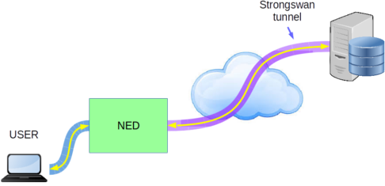
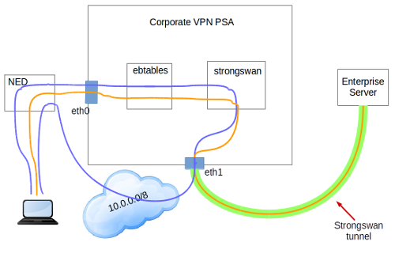

# 1. End-user 

## 1.1 Description / general readme


Most of the enterprises have more than one branch office and is very common to communicate them using an VPN. Corporate VPN PSA main point is to offer the user the possibility of having access to a server in the same enterprise, using an encrypted VPN tunnel. The tunnelling technology used for this PSA is Strongswan. 



## 1.2 Features / Capabilities

The capabilities extracted from manifest:

* Confidentiality protection
* Integrity protection
* IPSec protocol

The most important features are:
* Strongswan tunnels
* IPsec default encription protocol using certificates

## 1.3 Security policy examples


```
father;prot_conf_integr;Internet_traffic
```

* Enables the integrity protection

```
father;prot_conf;Internet_traffic
```

* Enables the confidentiality protection

```
father;prot_integr;Internet_traffic
```

* Allows the IPsec protocol for the tunelling


## 1.4 Support, troubleshooting / known issues

We totally supose both the server and the PSA have the correct certificates. For this reason, the only parameter the user must specify is the server ip address.

If there is any problem please ask your admin.

# 2. Developer / admin

## Description / general readme

The Corporate VPN PSA offers a secured tunnel to an enterprise server using the Strongswan technology. 

## Components and Requirements

VM technology allows creating a full system for the PSA. The components used in this PSA are:

* Operative System: Debian 7 "wheezy"
* iptables 
* ebtables
* jq
* brigde-utils
* Strongswan 5.1.2

From the PSA configuration it is needed to have an IP address in the PSA belonging to the same LAN than End user.

For the correct performance of the secured tunnel it is needed to have the VPN server well configured using the proper certificates and Strongswan configuration. For the ipsec.conf file you can follow the next example:

```
# /etc/ipsec.conf - strongSwan IPsec configuration file
config setup

conn %default
    ikelifetime=60m
    keylife=20m
    rekeymargin=3m
    keyingtries=3
    keyexchange=ikev2
 
    # various keepalive settings
    dpdaction=clear
    dpddelay=300s
    left=[admin must put the server IP address]
    leftfirewall=yes
    leftsubnet=0.0.0.0/0
    leftcert=clientCert.der	
    leftid=[must correspond to the certificate id]
conn psa
    right=%any
    #rightdns=10.31.0.1,8.8.8.8,8.8.4.4
    rightdns=8.8.8.8,8.8.4.4
    rightid=[must correspond to the certificate id]
    rightsourceip=[local NED ip subnetwork]
    rightsubnet=[local user ip subnetwork]
    auto=add
    rightfirewall=yes

```

## Detailed architecture

There are several components in the internal architecture:

* **Inspect and route traffic**. **ebtables** is used to set up rules to inspect Ethernet frames between eth0 and eth1 and force the traffic to be routed instead of being just bridged. By this, the traffic will be routed through the Strongswan tunnel. 

* **Use the tunnel**. **Strongswan**  passes all the traffic through the IPsec tunnel, except the 10.0.0.0/8 LAN. This LAN is needed to communicate with the NED directly.

The next figure shows the internal communication with/from the PSA:



### Rules

Only the traffic going to the 10.0.0.0/8 stays in the local LAN, all the other traffic passes through the tunnel.

### Certificates

For the correct performance the certificates must be exchanged between the client and server of the Strongswan tunnel. For their generation you can follow this [tutorial](https://wiki.strongswan.org/projects/1/wiki/SimpleCA) from the Strongswan site.

In our case, we used our own server (147.83.42.207) which already has the correct certificates for the PSA image. You can access to both the [server](strongswan/server) and [client](strongswan/psa) certificates.


## Virtual machine image creation

The procedure to create a valid PSA image from scratch start with the prerequisite instructions defined in  [PSA Developer guide](https://github.com/SECURED-FP7/secured-psa-develop-test) to obtain a valid base image for PSA. 

Install the software Strongswan 5.1.2:

	sudo apt-get install strongswan

Copy the necessary [files](PSA) of this project in the folder:

```
$HOME/phytonScript/
```

## Mobility Support
This PSA supports the mobility scenario.

## Support, troubleshooting / known issues

If there are any known issues, list them

We totally supose both the server and the PSA have the correct certificates. For this reason, the only parameter the user must specify is the server ip address.

## Files required

No extra files required.

### PSA application image

PSA is based on a Virtual machine image in KVM- kernel module format ".qcow2". A [sample image has been included](https://vm-images.secured-fp7.eu/images/priv/corporate-vpnPSA.qcow2) in the project.

### Manifest


* XML 

The PSA manifest in format XML is available at [Manifest](NED_files/TVDM/PSAManifest/corporate-vpnPSA.xml).
This file must be stored in the PSAR. And reflects the capabilities described below. 

* JSON
The PSA manifest is available at [Manifest](NED_files/TVDM/PSAManifest/corporate-vpnPSA).


### HSPL

The HSPL format is defined as follows:

* D4.1 format:

```
father;prot_conf_integr;Internet_traffic

father;prot_conf;Internet_traffic

father;prot_integr;Internet_traffic
```

* More friendly:

```
I enable the integrity protection on my internet traffic

I enable the protection on my internet traffic

I accept the IPSec protocol as my tunneling technology on my internet traffic
```

### MSPL

An example of MSPL for this PSA are accesible at SPM project: [UPC_server_connection_MSPL](https://github.com/SECURED-FP7/secured-spm/blob/master/M2LService/code/M2LPluginStrongswan/test_conf.mspl.base64)

### M2L Plug-in

The M2l plug-in is available at [M2LPlugin](https://github.com/SECURED-FP7/secured-spm/blob/master/M2LService/code/M2LPluginStrongswan/src/eu/securedfp7/m2lservice/plugin/M2LPlugin.java)

Current version of this plugin will generate a low level configuration like [this one](NED_files/TVDM/psaConfigs/corporate-vpnPSA/corporate-vpn_user8)

This plugin do not need additional external information in this version that must be store in the PSAR.


## Features/Capabilities

The capabilities extracted from manifest:

* Confidentiality protection
* Integrity protection
* IPSec protocol

The most important features are:
* Strongswan tunnels
* IPsec default encription protocol using certificates

## Testing

Testing scripts are available at [test folder](tests/)


# 3. License

Please refer to project LICENSE file.

This software incorporate only Strongswan which is an open source software licensed under the [GNU GPL](http://www.gnu.org/licenses/gpl-2.0.html).

# Additional Information 
## Partners involved

* Application: UPC
* MSPL: POLITO,UPC 
* M2L Plugin: UPC

# Status (OK/No/Partial) -*OK*-

# TODO:
* Tests

